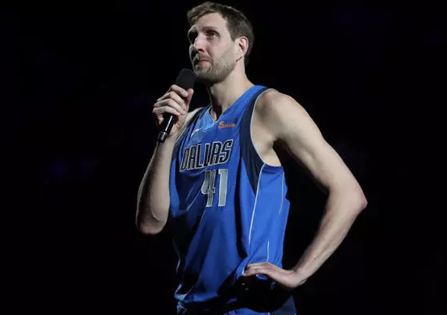
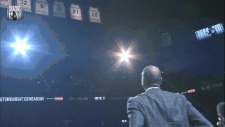
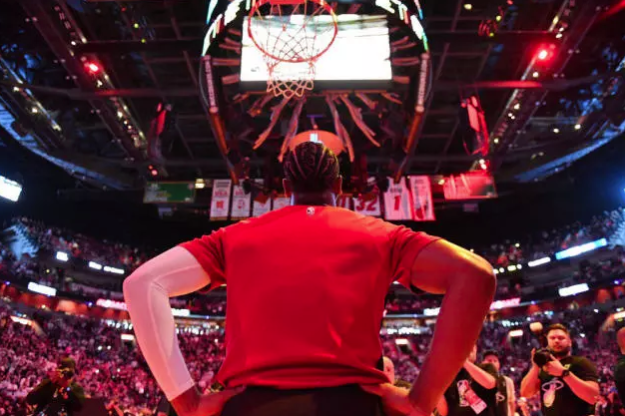

2019/4/10

星期三
> 吉诺比利球衣退役

> 诺维斯基，韦德退役了。。。

虽然没有眼含热泪，但是感觉自己的小时候的记忆慢慢走了，自己也慢慢长大了。

没有科比最后一季那样的“滚石巡演”排场，也不似韦德贯穿全季的“最后一舞”，德克-诺维茨基打完了他职业生涯最后一季的最后一个主场比赛。

看他们这几位打球的时候还是0几年的时候。印象最深的就是在1几年的时候，热火组成三巨头，勒布朗被全民指责。忘记了顺序是什么，那时候小牛队的中文名还没改成独行侠，诺天王单核带队决赛直面热火三巨头，看的真的是精彩，一手金鸡独立，芽儿呦，是真的diao。

之后就是吉诺比利和邓肯以及帕克带领（GDP）的马刺队杀入总决赛还是碰到了热火三巨头，印象最深的有两个场景，一个是邓肯拍地板的那种自责后悔，还有一个就是雷阿伦在接到波什传球后那一记绝杀，看的是真刺激，那场好像是抢七，就感觉马刺老了，如果没有在这场拿下整个系列赛那就悬了。比赛细节记不太清了，但之后莱昂纳德来了就帮助马刺赢下了一个总冠军，他也获得了FMVP。还有一个就是几年前，哈登带领的火箭最有希望的一年，被马努一个盖帽，整个赛季都没了。

看马努打球就感觉有点艺术的感觉（妖刀），他的集锦看的比较多...

韦德的话，怎么说呢（有点多）。

**This is my house.**

**What a play**

## Last

i love you guys

i appreciate it

thank you

**MVP MVP MVP ...**