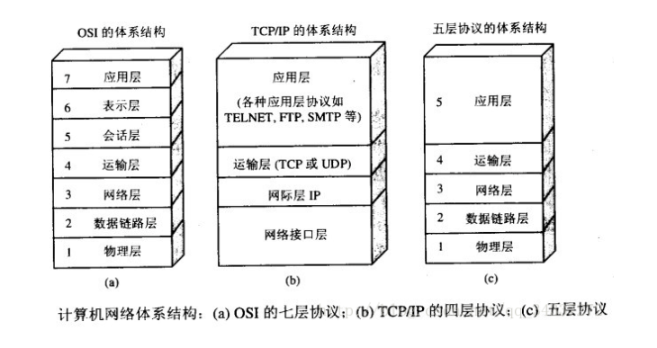
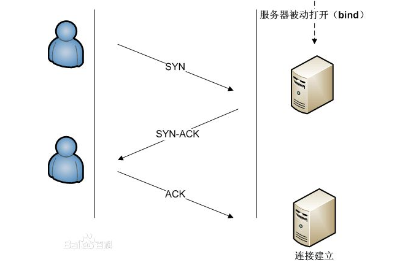
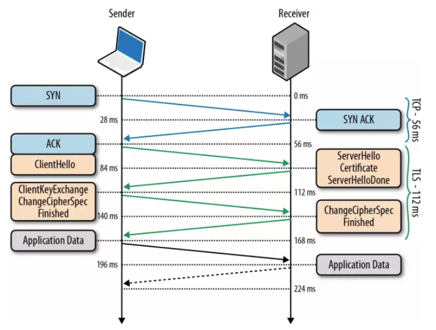

# 输入URL到展示的过程（网络篇）
## 绪论
> 整理下自己这段时间的学习内容，总结下看过的一些老师的文章，在其中加上一些自己的理解。

## 进程与线程
了解浏览器的进程与线程

* 进程是cpu资源分配的最小单位（是能拥有资源和独立运行的最小单位）
* 线程是cpu调度的最小单位（线程是建立在进程的基础上的一次程序运行单位，一个进程中可以有多个线程）

> 浏览器是多进程的，有一个主控进程，以及每一个tab页面都会新开一个进程（某些情况下多个tab会合并进程）

[从浏览器多进程到JS单线程，JS运行机制最全面的一次梳理](https://juejin.im/post/5a6547d0f265da3e283a1df7)

## 五层协议的体系结构
学习计算机网络必须先了解它的体系结构


1. 应用层(DNS,HTTP) DNS解析成IP并发送http请求

2. 传输层(TCP,UDP) 建立tcp连接（三次握手）

3. 网络层(IP,ARP) IP寻址

4. 数据链路层(PPP) 封装成帧

5. 物理层(利用物理介质传输比特流) 物理传输（然后传输的时候通过双绞线，电磁波等各种介质）

[搞定计算机网络面试，看这篇就够了](https://segmentfault.com/a/1190000015822376)

## 输入URL
> 例如输入www.google.com

URL一般包括几大部分内容：
* ``protocol``，协议头，譬如有http，ftp等
* ``host``，主机域名或IP地址
* ``port``，端口号
* ``path``，目录路径
* ``query``，查询参数
* ``fragment``，即``#``后的hash值，一般用来定位到某个位置

### 网络请求都是单独的线程

每次网络请求时都需要开辟单独的线程进行，譬如如果URL解析到http协议，就会新建一个网络线程去处理资源下载。

因此浏览器会根据解析出得协议，开辟一个网络线程，前往请求资源（这里，暂时理解为是浏览器内核开辟的，如有错误，后续修复）。

## DNS查询
**域名系统**（英文：DomainNameSystem，缩写：DNS）是互联网的一项服务。它作为将域名和IP地址相互映射的一个分布式数据库，能够使人更方便地访问互联网。DNS使用``TCP``和``UDP``端口53，这种单个应用协议同时使用两种传输协议的情况在TCP/IP栈也算是个另类。

输入URL之后，首先进行的就是DNS查询。浏览器要查找域名的IP地址，查看浏览器缓存、路由器缓存、系统缓存，如果都没有会直接去DNS根服务器查询。

1. 浏览器根据输入的URL地址解析出主机名。
2. 浏览器将主机名转换成服务器ip地址。浏览器先查找本地DNS缓存列表，看缓存里面是否存在这个ip，如果有则进入第3步，如果缓存中不存在这个ip地址，就再向浏览器默认的DNS服务器发送查询请求，同时缓存当前这个ip到DNS缓存列表中。
3. 拿到ip地址后，浏览器再从URL中解析出端口号。
4. 拿到ip和端口后，浏览器会建立一条与目标Web服务器的TCP连接，也就是传说中的三次握手。（后面说）

> DNS在进行区域传输的时候使用TCP协议，其它时候则使用UDP协议；

DNS的规范规定了2种类型的DNS服务器，一个叫主DNS服务器，一个叫辅助DNS服务器。在一个区中主DNS服务器从自己本机的数据文件中读取该区的DNS数据信息，而辅助DNS服务器则从区的主DNS服务器中读取该区的DNS数据信息。当一个辅助DNS服务器启动时，它需要与主DNS服务器通信，并加载数据信息，这就叫做区传送（zone transfer）。

区域传送时使用TCP，主要有一下两点考虑：

1. 辅域名服务器会定时（一般时3小时）向主域名服务器进行查询以便了解数据是否有变动。如有变动，则会执行一次区域传送，进行数据同步。区域传送将使用TCP而不是UDP，因为数据同步传送的数据量比一个请求和应答的数据量要多得多。
2. TCP是一种可靠的连接，保证了数据的准确性。

域名解析时使用UDP协议：

客户端向DNS服务器查询域名，一般返回的内容都不超过512字节，用UDP传输即可。不用经过TCP三次握手，这样DNS服务器负载更低，响应更快。虽然从理论上说，客户端也可以指定向DNS服务器查询的时候使用TCP，但事实上，很多DNS服务器进行配置的时候，仅支持UDP查询包。

> 在DNS解析中我们可以考虑使用``DNS Prefetch``（DNS预获取）。需要注意的是，虽然使用 DNS Prefetch 能够加快页面的解析速度，但是也不能滥用，因为有开发者指出 禁用DNS 预读取能节省每月100亿的DNS查询 。

DNS Prefetch 应该尽量的放在网页的前面，推荐放在 ``<meta charset="UTF-8">`` 后面。具体使用方法如下：

```html
<meta http-equiv="x-dns-prefetch-control" content="on">
<link rel="dns-prefetch" href="//www.example.net">
<link rel="dns-prefetch" href="//api.share.example.net">
<link rel="dns-prefetch" href="//bgimg.share.example.net">
```
如果需要禁止隐式的 DNS Prefetch，可以使用以下的标签：
```html
<meta http-equiv="x-dns-prefetch-control" content="off">
```
## 发送HTTP请求

完成DNS查询，获取域名对应的IP后，浏览器会向WEB服务器发生一个``HTTP``请求。（``cookies``会随着请求发送给服务器
> HTTP是基于TCP/IP协议的

### 与服务器建立TCP连接

> TCP握手，应用层会下发数据给传输层，这里TCP协议会指明两端的端口号，然后下发给网络层。网络层中的IP协议会确定IP地址，并且指示了数据传输中如何跳转路由器。然后包会再被封装到数据链路层的数据帧结构中，最后就是物理层面的传输了。

tcp将http长报文划分为短报文，通过三次握手与服务端建立连接，进行可靠传输。

**TCP/IP的并发限制**

浏览器对同一域名下并发的TCP连接是有限制的（2-10个不等）而且在HTTP1.0中往往一个资源下载就需要对应一个TCP/IP请求。

**建立连接的三次握手**

起初，两端都为CLOSED状态。在通信开始前，双方都会创建TCB。服务器创建完TCB后便进入LISTEN状态，此时开始等待客户端发送数据。

第一次握手：客户端发送SYN（SEQ=x）报文给服务器端，进入SYN_SEND状态。

第二次握手：服务器端收到SYN报文，回应一个SYN （SEQ=y）ACK(ACK=x+1）报文，进入SYN_RECV状态。

第三次握手：客户端收到服务器端的SYN报文，回应一个ACK(ACK=y+1）报文，进入Established状态。

三次握手完成，TCP客户端和服务器端成功地建立连接，可以开始传输数据了。

**传了SYN，为啥还要传ACK（确认序号有效）？**

双方通信无误必须是两者互相发送信息都无误。传了SYN，证明发送方到接收方的通道没有问题，但是接收方到发送方的通道还需要ACK信号来进行验证。



当客户端认为数据发送完成，进行断开连接操作

### 与服务器断开TCP连接

> 断开TCP连接需要经过四次挥手，这是因为TCP是全双工的。

``全双工``（Full Duplex）是通讯传输的一个术语。通信允许数据在两个方向上同时传输，它在能力上相当于两个单工通信方式的结合。全双工指可以同时（瞬时）进行信号的双向传输（A→B且B→A）。指A→B的同时B→A，是瞬时同步的。

第一次挥手：某个应用进程首先调用close，称该端执行“主动关闭”（active close）。该端的TCP于是发送一个FIN分节，表示数据发送完毕。

第二次挥手：接收到这个FIN的对端执行 “被动关闭”（passive close），这个FIN由TCP确认。

注意：FIN的接收也作为一个文件结束符（end-of-file）传递给接收端应用进程，放在已排队等候该应用进程接收的任何其他数据之后，因为，FIN的接收意味着接收端应用进程在相应连接上再无额外数据可接收。

第三次挥手：一段时间后，接收到这个文件结束符的应用进程将调用close关闭它的套接字。这导致它的TCP也发送一个FIN。

第四次挥手：接收这个最终FIN的原发送端TCP（即执行主动关闭的那一端）确认这个FIN。


**在握手与挥手的过程中，往复的ACK与SYN有什么含义？**

这是通信双方在通信过程中的一种确认手段，确保通信双方通信的正确性。

**在结束连接的过程中，为什么在收到服务器端的连接释放报文段之后，客户端还要继续等待2MSL之后才真正关闭TCP连接呢？**

这里有两个原因：

第一个是：需要保证服务器端收到了客户端的最后一条确认报文。假如这条报文丢失，服务器没有接收到确认报文，就会对连接释放报文进行超时重传，而此时客户端连接已关闭，无法做出响应，就造成了服务器端不停重传连接释放报文，而无法正常进入关闭状态的状况。而等待2MSL，就可以保证服务器端收到了最终确认；若服务器端没有收到，那么在2MSL之内客户端一定会收到服务器端的重传报文，此时客户端就会重传确认报文，并重置计时器。

第二个是：存在一种“已失效的连接请求报文段”，需要避免这种报文端出现在本连接中，造成异常。这种“已失效的连接请求报文段”是这么形成的：假如客户端发出了连接请求报文，然而服务器端没有收到，于是客户端进行超时重传，再一次发送了连接请求报文，并成功建立连接。然而，第一次发送的连接请求报文并没有丢失，只是在某个网络结点中发生了长时间滞留，随后，这个最初发送的报文段到达服务器端，会使得服务器端误以为客户端发出了新的请求，造成异常。

**若通信双方同时请求连接或同时请求释放连接，情况如何？**

这种情况虽然发生的可能性极小，但是是确实存在的，TCP也特意设计了相关机制，使得在这种情况下双方仅建立一条连接。双方同时请求连接的情况下，双方同时发出请求连接报文，并进入SYN-SENT状态；当收到对方的请求连接报文后，会再次发送请求连接报文，确认号为对方的SYN+1，并进入SYN-RCVD状态；当收到对方第二次发出的携带确认号的请求报文之后，会进入ESTAB-LISHED状态。 双方同时请求释放连接也是同样的，双方同时发出连接释放报文，并进入FIN-WAIT-1状态；在收到对方的报文之后，发送确认报文，并进入CLOSING状态；在收到对方的确认报文后，进入TIME-WAIT状态，等待2MSL之后关闭连接。需要注意的是，这个时候虽然不用再次发送确认报文并确认对方收到，双方仍需等待2MSL之后再关闭连接，是为了防止“已失效的连接请求报文段”的影响。

### UDP与TCP

[``UDP``](https://baike.baidu.com/item/UDP/571511?fr=aladdin)

首先说说UDP协议吧，UDP是面向无连接的，也就是说不需要在正式传递数据之前先接连起双方。UDP协议只是数据报文的搬运工，不保证有序且不丢失的传递到对端，并且UDP也没有任何控制流量的算法，总的来说UDP相较于TCP更加轻便。

**UDP的特点**

> * 面向无连接
> * 传输的数据不可靠
> * 高效

**传输方式：**

UDP不止支持一对一的传输方式，同样支持一对多，多对多，多对一的方式，也就是说UDP提供了单播、多播、广播的功能。

**适合使用的场景**

一些对实时性要求高的地方（例如：直播、对战游戏、视频电话会议系统）

[``TCP``](https://baike.baidu.com/item/TCP/33012?fr=aladdin)

TCP基本是和UDP反着来的，建立连接断开连接都需要进行握手。在数据传输的过程当中，通过各种算法保证数据的可靠性，带来的问题就是没有UDP这么高效。

[``ARQ``](https://baike.baidu.com/item/ARQ/7402812?fr=aladdin)
[``ARP``](https://baike.baidu.com/item/ARP/609343?fr=aladdin)
[``OSPF``](https://baike.baidu.com/item/%E7%BB%84%E6%92%AD%E6%89%A9%E5%B1%95OSPF/288964?fr=aladdin)

## HTTP
> 超文本传输协议（HTTP，HyperText Transfer Protocol)是互联网上应用最为广泛的一种网络协议。所有的WWW文件都必须遵守这个标准。设计HTTP最初的目的是为了提供一种发布和接收HTML页面的方法。（百度百科）

``HTTP``请求由三部分组成，分别为：
* 请求行
* 首部
* 实体

**HTTP请求方式**

HTTP协议中共定义了八种方法或者叫“动作”来表明对Request-URI指定的资源的不同操作方式，具体介绍如下：

* OPTIONS：返回服务器针对特定资源所支持的HTTP请求方法。也可以利用向Web服务器发送'*'的请求来测试服务器的功能性。
* HEAD：向服务器索要与GET请求相一致的响应，只不过响应体将不会被返回。这一方法可以在不必传输整个响应内容的情况下，就可以获取包含在响应消息头中的元信息。
* GET：向特定的资源发出请求。
* POST：向指定资源提交数据进行处理请求（例如提交表单或者上传文件）。数据被包含在请求体中。POST请求可能会导致新的资源的创建和/或已有资源的修改。
* PUT：向指定资源位置上传其最新内容。
* DELETE：请求服务器删除Request-URI所标识的资源。
* TRACE：回显服务器收到的请求，主要用于测试或诊断。
* CONNECT：HTTP/1.1协议中预留给能够将连接改为管道方式的代理服务器。

虽然HTTP的请求方式有8种，但是我们在实际应用中常用的也就是get和post，其他请求方式也都可以通过这两种方式间接的来实现。

**get和post的区别**

```
先介绍下副作用和幂等的概念：
副作用是指对服务器上的资源做改变，搜索是无副作用的，注册是有副作用的
幂等指发送M和N请求（两者不相同且都大于1），服务器上资源的状态一致。例如注册10个用户和注册11个用户是不幂等的，因为它多出了一个用户，就是多占了一份资源。但是你对一篇文章改100次或者200次，因为这是对一个资源进行更新，所以就是幂等的。
```

> GET多用于无副作用，幂等的场景（查询之类的）。POST则是多用于有副作用，不幂等的场景（添加用户之类的）

* GET一般用于获取/查询资源信息，而POST一般用于更新资源信息。
* GET产生的URL地址可以被Bookmark（书签或者标记），而POST不可以。
* GET请求会被浏览器主动cache（收藏），而POST不会，除非手动设置。
* GET请求参数会被完整保留在浏览器历史记录里，而POST中的参数不会被保留。
* GET请求在URL中传送的参数是有长度限制的，而POST没有，POST放在Request body中。
* 对参数的数据类型，GET只接受ASCII字符，而POST没有限制。
* GET比POST更不安全，因为参数直接暴露在URL上，所以不能用来传递敏感信息。

GET和POST还有一个重大区别，简单的说：
GET产生一个TCP数据包；POST产生两个TCP数据包。（POST耗费的资源多）

HTTP协议中提到GET是安全的方法（safe method），其意思是说GET方法不会改变服务器端数据，所以不会产生副作用。如果是该用POST的地方用了GET，又说GET不安全，那GET也太冤枉了。也就是说，只要我们正确选择使用GET和POST，那么GET是安全的。

只要我们正确使用二者，因为GET方法中不对数据进行修改，不传送一些保密的信息，而这些需要由POST来传输，所以说GET不存在安全问题，而需要注意的是POST传输的安全问题。

正确使用二者，怎么算GET和POST两者正确的选择来使用了。这些规矩或者规范，是怎么制定的呢？为什么说get不能传送加密信息和修改数据呢？

原因还是说它没有POST安全，所以HTTP协议规定了它用来传输不重要的读操作，所以才不会因为它而产生安全问题。因为它传送的数据不值得别人去盗取，没有价值。

## HTTPS

HTTPS即HTTP下加入SSL层，HTTPS的安全基础是SSL，因此加密的详细内容就需要SSL，SSL升级到TLS，通过TLS协议进行加密。

TLS协议位于传输层之上，应用层之下。首次进行TLS协议传输需要两个RTT，接下来可以通过SessionResumption减少到一个RTT。

在TLS中使用了两种加密技术，分别为：``对称加密``和``非对称加密``。

对称加密：对称加密就是两边拥有相同的秘钥，两边都知道如何将密文加密。问题在于如何让双方知道秘钥。因为传输都是走网络的，如果将秘钥通过网络的方式传递的话，一旦被截获就没有加密的意义了。对称加密算法的优点是算法公开、计算量小、加密速度快、加密效率高。

非对称加密：非对称加密算法需要两个密钥来进行加密和解密，这两个秘钥是公开密钥（public key，简称公钥）和私有密钥（private key，简称私钥）。非对称加密与对称加密相比，其安全性更好：对称加密的通信双方使用相同的秘钥，如果一方的秘钥遭泄露，那么整个通信就会被破解。而非对称加密使用一对秘钥，一个用来加密，一个用来解密，而且公钥是公开的，秘钥是自己保存的，不需要像对称加密那样在通信之前要先同步秘钥。
（[RSA算法](https://baike.baidu.com/item/RSA%E7%AE%97%E6%B3%95?fromtitle=RSA&fromid=210678)）

> 对称加密技术虽然比公钥加密技术的速度快，可是公钥加密技术提供了更好的身份认证技术。



客户端和服务器协商各种参数用于创建安全连接：

1. 当客户端连接到支持TLS协议的服务器要求创建安全连接并列出了受支持的密码组合（加密密码算法和加密哈希函数），握手开始。
2. 服务器从该列表中决定加密和散列函数，并通知客户端。
3. 服务器发回其数字证书，此证书通常包含服务器的名称、受信任的证书颁发机构（CA）和服务器的公钥。
4. 客户端确认其颁发的证书的有效性。
5. 为了生成会话密钥用于安全连接，客户端使用服务器的公钥加密随机生成的密钥，并将其发送到服务器，只有服务器才能使用自己的私钥解密。
6. 利用随机数，双方生成用于加密和解密的对称密钥。这就是TLS协议的握手，握手完毕后的连接是安全的，直到连接（被）关闭。如果上述任何一个步骤失败，TLS握手过程就会失败，并且断开所有的连接。

**HTTP与HTTPS的区别**

一、HTTPS协议需要到CA申请证书，一般免费证书很少，需要交费。

二、HTTP是超文本传输协议，信息是明文传输，HTTPS则是具有安全性的SSL加密传输协议。

三、HTTP和HTTPS使用的是完全不同的连接方式，用的端口也不一样，前者是80，后者是443。

四、HTTP的连接很简单，是无状态的；HTTPS协议是由SSL+HTTP协议构建的可进行加密传输、身份认证的网络协议，比HTTP协议安全。

## HTTP/2
[Wikipedia的解释](https://en.wikipedia.org/wiki/HTTP/2)

HTTP/2肯定是要比HTTP/1要快很多的，只需要升级到该协议就可以减少很多的性能上的消耗，从而减少许多性能优化的工作，但是兼容问题以及如何优雅降级应该是国内还不普遍使用的原因之一。

### 特点

* 二进制传输
* 多路复用
* Header压缩
* ...

## HTTP/3
[Wikipedia的解释](https://en.wikipedia.org/wiki/HTTP/3)

基于UDP协议。

## 分享
[Skillet - One day too late](https://music.163.com/#/song?id=19164061&autoplay=true&market=baiduhd)

```
Today I'm gonna try a little harder 
Gonna make every minute last longer
Gonna learn to forgive and forget
'Cause we don't have long,
Gonna make the most of it

Today I'm gonna love my enemies
Reach out to somebody who needs me
Make a change, make the world a better place
'Cause tomorrow could be one day too late
One day too late
One day too late
```

下一篇文章说说HTTP报文，浏览器缓存等，还是计算机网络的知识（因为仔细去学习之后，发现这东西太多了，而且学的还不深 :sob: ）