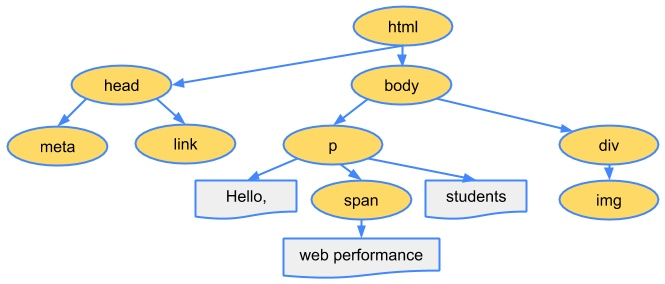
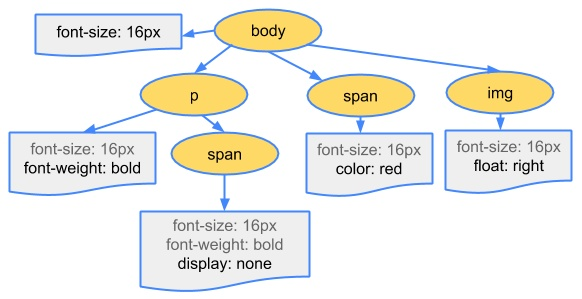

# 输入URL到展示的过程（渲染篇）
## 前言
> 前两篇大概说了下输入URL到展示的过程中在网络上的一些过程，这一篇要说的是浏览器的渲染过程。

## 接受到数据
假设我们成功的接受到了服务器返回给我们的数据（200），并且数据是一个HTML文件。

## 开始解析
> 在Chorme浏览器中讨论


浏览器渲染过程如下：

1. 解析HTML，生成DOM树，解析CSS，生成CSSOM树
2. 将DOM树和CSSOM树结合，生成渲染树(Render Tree)
3. Layout(回流):根据生成的渲染树，进行回流(Layout)，得到节点的几何信息（位置，大小）
4. Painting(重绘):根据渲染树以及回流得到的几何信息，得到节点的绝对像素
5. Display:将像素发送给GPU，展示在页面上。（这一步其实还有很多内容，比如会在GPU将多个合成层合并为同一个层，并展示在页面中。而css3硬件加速的原理则是新建合成层，这里我们不展开，之后有机会会写一篇博客）

### 构建DOM树

首先解析HTML文件，因为内容在网络传输过程中都是0和1这些字节数据，所以当浏览器接受到这些字节数据时，会对其进行解析。

首先，浏览器会把这些字节数据（Bytes）转换成字符串（characters），就是我们写的代码。之后，通过HTML的词法分析把这些字符串转换成标记（tokens），这一过程在词法分析中叫做标记化。再后来根据这些标记，形成一个个节点（nodes），最后根据这一个个节点形成一颗DOM树。
```
1. Conversion转换：浏览器将获得的HTML内容（Bytes）基于他的编码转换为单个字符

2. Tokenizing分词：浏览器按照HTML规范标准将这些字符转换为不同的标记token。每个token都有自己独特的含义以及规则集

3. Lexing词法分析：分词的结果是得到一堆的token，此时把他们转换为对象，这些对象分别定义他们的属性和规则

4. DOM构建：因为HTML标记定义的就是不同标签之间的关系，这个关系就像是一个树形结构一样
例如：body对象的父节点就是HTML对象，然后段略p对象的父节点就是body对象
```


> Bytes → characters → tokens → nodes → DOM

### 构建CSSOM
大概过程是差不多的
> Bytes → characters → tokens → nodes → CSSOM

``CSSOM``指的是CSS Object Modle

```css
body { font-size: 16px }
p { font-weight: bold }
span { color: red }
p span { display: none }
img { float: right }
```



在设置样式的这一过程中需要耗费很多资源。因为样式可以通过自定义，也可以通过继承获得。在这一过程中，浏览器需要去递归CSSOM树，然后确定具体的元素到底是什么样式。所以我们应该尽可能的避免写过于具体的CSS选择器，然后对于HTML来说也尽量少的添加无意义的标签，保证``层级扁平``。

### 生成Render Tree


为了构建渲染树，浏览器主要完成了以下工作：

从DOM树的根节点开始遍历每个可见节点。
对于每个可见的节点，找到CSSOM树中对应的规则，并应用它们。
根据每个可见节点以及其对应的样式，组合生成渲染树。
第一步中，既然说到了要遍历可见的节点，那么我们得先知道，什么节点是不可见的。不可见的节点包括：

一些不会渲染输出的节点，比如script、meta、link等。
一些通过css进行隐藏的节点。比如display:none。注意，利用visibility和opacity隐藏的节点，还是会显示在渲染树上的。只有display:none的节点才不会显示在渲染树上。

> 注意：渲染树只包含可见的节点

## 回流重绘

### 回流

前面我们通过构造渲染树，我们将可见DOM节点以及它对应的样式结合起来，可是我们还需要计算它们在设备视口(viewport)内的确切位置和大小，这个计算的阶段就是回流。

### 重绘

最终，我们通过构造渲染树和回流阶段，我们知道了哪些节点是可见的，以及可见节点的样式和具体的几何信息(位置、大小)，那么我们就可以将渲染树的每个节点都转换为屏幕上的实际像素，这个阶段就叫做重绘节点。

## 图层

### 普通图层

### 复合图层

浏览器会将各层的信息发送给GPU，GPU会将各层合成（composite），显示在屏幕上。

[你真的了解回流和重绘吗](https://segmentfault.com/a/1190000017329980)

[前端性能优化：细说浏览器渲染的重排与重绘](https://www.imooc.com/article/45936)

[从浏览器多进程到JS单线程，JS运行机制最全面的一次梳理](https://segmentfault.com/a/1190000012925872) *

[为什么说DOM操作很慢](https://kb.cnblogs.com/page/534571/)

[How browsers work](http://taligarsiel.com/Projects/howbrowserswork1.htm) *

这个内容有点多，我觉得大佬们说的很详细了。下一篇说下浏览器解析JS的情况。

## 分享

[Coldplay / Cat Power - Wish I Was Here](https://music.163.com/#/song?id=28773544)

```
Every road, that's wrong
Seems like the road, I'm on
Every sign just seems unclear
Won't you come switch me on
Don't, know where I've gone
And I, I wish I was here
```